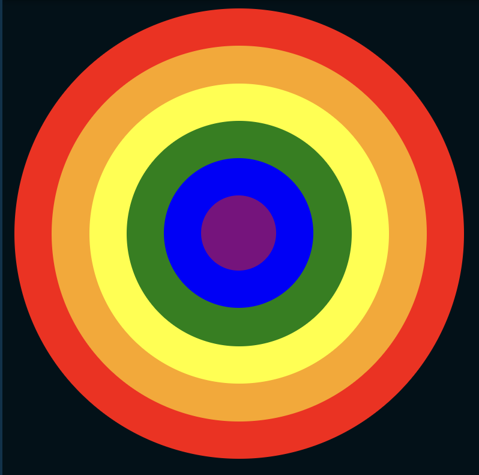

## Rainbow Circles

```
Se te proporciona un archivo HTML con tres div anidados, cada uno con un ID único.

Utilizando solo CSS, estiliza el HTML para que tenga la apariencia de seis círculos concéntricos de diferentes colores.

De afuera hacia adentro, los círculos deben tener las siguientes características:

- 300px por 300px, #ff0000 (rojo)
- 250px por 250px, #ffa500 (naranja)
- 200px por 200px, #ffff00 (amarillo)
- 150px por 150px, #008000 (verde)
- 100px por 100px, #0000ff (azul)
- 50px por 50px, #800080 (púrpura)

Aunque hay varias formas de lograr este resultado deseado, para este problema, todos los colores deben lograrse utilizando propiedades de colores de fondo y/o del modelo de caja.

Tu entrega será evaluada en función de cuán similar sea tu resultado en el navegador al resultado esperado; debe ser casi idéntico.
```
## HTML (no modificar)
```html
  <div id="outer">
    <div id="middle">
      <div id="inner"></div>
    </div>
  </div>
```
## Sugerencia de presentación
