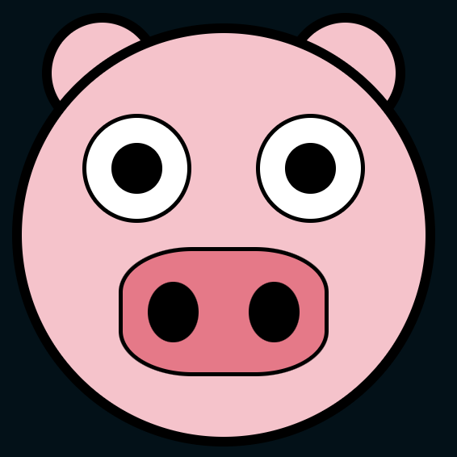

# CSS 4 - Pig emoji

```
Se te proporciona un archivo HTML con marcado HTML para estilar un emoji de cerdo.

Usando solo CSS, estiliza el HTML para que tenga la apariencia de un emoji de cerdo con las siguientes características:

- La cabeza debe ser un círculo perfecto con un ancho y alto de 200px, un margen superior de 20px y un color de fondo de #ffc0cb.
- Las orejas deben ser círculos perfectos, cada uno con un ancho y alto de 50px. Deben posicionarse detrás de la cabeza y a 10px hacia adentro desde los bordes izquierdo y derecho de la cabeza, respectivamente. También deben sobresalir por encima de la cabeza por 10px, y deben tener el mismo color de fondo que la cabeza.
- Los ojos deben ser círculos perfectos, cada uno con un ancho y alto de 50px. Deben posicionarse a 40px desde la parte superior de la cabeza y a 30px desde los bordes izquierdo y derecho de la cabeza, respectivamente. Deben tener un color de fondo blanco.
- Cada ojo contiene una pupila, que debe tener la mitad del tamaño del ojo con un radio de borde del 50%. Las pupilas deben estar centradas en su respectivo ojo y deben tener un color de fondo negro.
- La nariz debe tener un ancho de 100px y un alto de 60px. Debe estar centrada horizontalmente y posicionada a 30px desde la parte inferior de la cabeza. Además, debe tener un radio de borde del 35% y un color de fondo de #f57187.
- La nariz contiene dos orificios nasales, cada uno con una altura que es el 50% de la altura de la nariz y un ancho que es el 25% del ancho de la nariz. Los orificios nasales deben estar centrados verticalmente con espacio horizontal alrededor de ellos (el doble de espacio entre ellos que desde el borde de la nariz). Además, deben tener un radio de borde del 50% y un color de fondo negro.
- La cabeza y ambas orejas deben tener un borde sólido negro de 5px, mientras que la nariz y ambos ojos deben tener un borde negro sólido de 2px.

Tu envío se evaluará según la similitud de la salida del navegador con la Salida Esperada; debe ser casi idéntica.
```
## HTML (no modificar)
```html
  <div class="head">
    <div>
      <div class="ear"></div>
      <div class="ear"></div>
    </div>

    <div>
      <div class="eye">
        <div class="pupil"></div>
      </div>
      <div class="eye">
        <div class="pupil"></div>
      </div>
    </div>

    <div class="nose">
      <div class="nostril"></div>
      <div class="nostril"></div>
    </div>
  </div>
```

## Sugerencia de presentación


## Pista
Se puede seleccionar el primer elemento o el último, o cualquier de en medio, entre varios de una clase, por ejemplo:
```css
  .ear{
    /* Seleccionar ambos eementos de class "ear"*/
  }
  .ear:first-of-type{
    /* El primer div de class "ear" (izquierda) */
  }
  .ear:last-of-type{
    /* El último div de class "ear" (derecha) */
  }

  /*
  :nth-of-type(even) -> elementos pares 
  :nth-of-type(odd)  -> elementos impares
  .ear:nth-of-type(1)    -> primer .ear
  .ear:nth-of-type(2)    -> segundo .ear
  */
```
Más información: 
- https://developer.mozilla.org/en-US/docs/Web/CSS/:first-of-type
- https://developer.mozilla.org/en-US/docs/Web/CSS/:last-of-type
- https://developer.mozilla.org/en-US/docs/Web/CSS/:nth-of-type