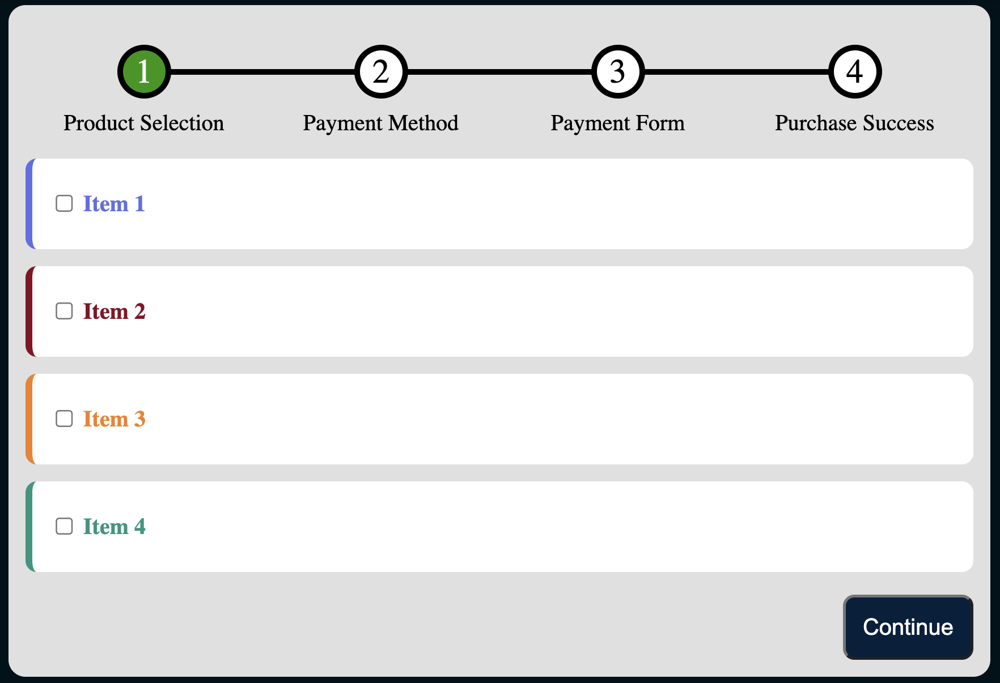

# CSS 5 - Purchase Form

```
Se te proporciona un archivo HTML con la marca para un formulario de compra, similar al formulario de compra real en AlgoExpert.

Usando solo CSS, estiliza el formulario de compra con las siguientes características:

- El elemento #wrapper debe tener 12px de relleno, un radio de borde de 12px y un color de fondo de #e0e0e0.
- La lista ordenada debe tener estilo como un componente de pasos:
  - Este componente de pasos debe estar centrado horizontalmente sin relleno, pero debe mantener su margen vertical predeterminado.
  - Cada elemento de la lista en el componente de pasos debe tener su número de ítem correspondiente encima de su contenido de texto, y este número debe estar dentro de un círculo con un color de fondo blanco, un ancho de 30px, 8px de margen inferior, un tamaño de fuente de 24px y un borde sólido negro de 4px. El número dentro del círculo debe estar centrado horizontal y verticalmente, y el círculo debe estar centrado horizontalmente sobre el contenido de texto.
  - El círculo con el número para el elemento de lista con la clase seleccionada debe tener un texto blanco y un color de fondo de #279600.
  - Entre cada par de círculos con números adyacentes debe haber una línea horizontal negra de 4px de alto. Estas líneas divisoras deben estar centradas verticalmente con respecto a los círculos con números, y deben estar justo entre los círculos, tocando sus bordes.

- La lista desordenada debe tener el siguiente estilo:
  - La lista desordenada debe mantener su margen predeterminado, pero no debe tener relleno.
  - Cada elemento de lista en la lista desordenada representa una oferta de producto única y debe tener 12px de relleno, 12px de margen vertical, una altura de 40px, un radio de borde de 8px, fuente en negrita y un color de fondo blanco.
  - Las etiquetas deben tener 4px de margen izquierdo y un color de texto basado en la clase del elemento de lista, siguiendo este mapeo:
    - .blue-product: #626ee3
    - .red-product: #890023
    - .orange-product: #f37f1b
    - .green-product: #11967e
  - Cada elemento de lista de oferta de producto también debe tener un borde izquierdo sólido de 5px del mismo color que su texto.

- El botón "Continuar" debe estar alineado en el lado derecho del #wrapper, con 12px de relleno, un tamaño de fuente de 16px, un radio de borde de 8px, un color de fondo de #02203c y un color de texto blanco.

Para mayor comodidad, el código inicial incluye variables con la mayoría de los valores de píxeles y colores especificados.

Tu envío se evaluará según la similitud de la salida del navegador con la Salida Esperada; debe ser casi idéntica.
```
## HTML (no modificar)
```html
  <div id="wrapper">
    <ol>
      <li class="selected">Product Selection</li>
    <li>Payment Method</li>
    <li>Payment Form</li>
    <li>Purchase Success</li>
  </ol>

  <ul>
    <li class="blue-product">
      <input type="checkbox" id="item_1" />
      <label for="item_1">Item 1</label>
    </li>
    <li class="red-product">
      <input type="checkbox" id="item_2" />
      <label for="item_2">Item 2</label>
      </li>
      <li class="orange-product">
        <input type="checkbox" id="item_3" />
        <label for="item_3">Item 3</label>
      </li>
      <li class="green-product">
        <input type="checkbox" id="item_4" />
        <label for="item_4">Item 4</label>
      </li>
    </ul>


  <button>Continue</button>
</div>

```
## Sugerencia de presentación
