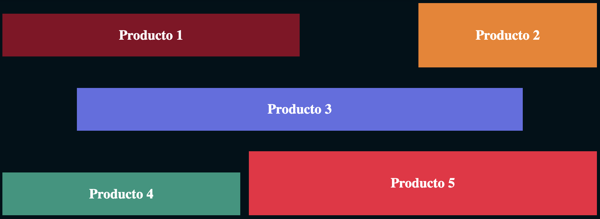

# CSS 6 - Products

```
Se te proporciona un archivo HTML que contiene divs que representan los productos de una página. Usando solo CSS, alinea los productos en tres filas siguiendo estas especificaciones:

- La primera fila contiene "Producto 1" y "Producto 2", en ese orden.
  - "Producto 1" tiene un ancho del 50% del ancho del contenedor.
  - "Producto 2" tiene un ancho del 30% del ancho del contenedor, y todo el espacio horizontal restante está entre ellos.
  - "Producto 2" tiene una altura de 75px, y "Producto 1" está centrado verticalmente en la fila.

- La segunda fila contiene solo "Producto 3", que tiene un ancho del 75% del ancho del contenedor y está centrado horizontalmente.

- La tercera fila contiene "Producto 4" y "Producto 5", en ese orden.
  - "Producto 4" tiene un ancho del 40% del ancho del contenedor.
  - "Producto 5" ocupa cualquier espacio horizontal restante, dejando 10px entre los dos productos.
  - "Producto 5" tiene una altura de 75px, y FrontendExpert se ajusta a la parte inferior de la fila.

- Las tres filas tienen un espacio vertical de 24px entre ellas.

- Todos los demás estilos son estilos predeterminados del navegador o estilos del código inicial.

Tu envío se evaluará según la similitud de la salida del navegador con la Salida Esperada; debe ser casi idéntica.
```
## HTML  (no modificar)
```html
  <div>
    <div class="product" id="product_1">Product 1</div>
    <div class="product" id="product_2">Product 2</div>
    <div class="product" id="product_3">Product 3</div>
    <div class="product" id="product_4">Product 4</div>
    <div class="product" id="product_5">Product 5</div>
  </div>
```
## Sugerencia de presentación
