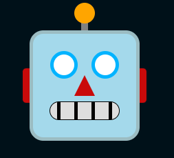

# CSS 7 Robot Emoji

```
Se te proporciona un archivo HTML con la marcación para un emoji de cabeza de robot.

Usando solo CSS, estiliza el HTML para que tenga la apariencia de un emoji de robot con las siguientes características:

- La cabeza debe ser un cuadrado perfecto con un ancho y alto de 150px, un margen de 50px y un color de fondo de #a4d9eb. La cabeza también debe tener un borde sólido de 5px en color #9bbcc2 y un radio de borde de 20px.
- Una luz debe estar posicionada en la parte superior del borde de la cabeza. Esta luz debe estar centrada horizontalmente con respecto a la cabeza. La bombilla debe ser un círculo perfecto con un ancho y alto de 30px y un color de fondo de #ffa500. El palo de la luz debe ser un rectángulo con un ancho de 10px, una altura de 15px y un color de fondo de #808080. La bombilla debe estar posicionada en la parte superior del palo, con un solapamiento de 5px.
- Las orejas deben ser rectángulos con un ancho de 10px, una altura de 50px y colores de fondo de #c90a0a. Deben estar posicionadas contra los lados izquierdo y derecho del borde de la cabeza. La oreja izquierda debe tener un radio de borde superior izquierdo e inferior izquierdo de 5px, y la oreja derecha debe tener un radio de borde superior derecho e inferior derecho de 5px. Las orejas deben estar centradas verticalmente con respecto a la cabeza.
- Los ojos deben ser círculos perfectos, cada uno con un ancho y alto de 30px. Deben estar posicionados a 25px desde la parte superior de la cabeza (30px desde el borde superior de la cabeza). Debe haber un espacio de 20px entre los ojos, y deben estar centrados horizontalmente en la cabeza. Cada ojo debe tener un color de fondo blanco y un borde sólido de 5px en color #00b3ff.
- La nariz debe ser un triángulo con un color de fondo de #c90a0a. Este triángulo debe tener un ancho y alto de 30px. El triángulo debe apuntar hacia arriba (es decir, el borde de 30px debe ser paralelo a la parte inferior de la cabeza). La nariz debe estar centrada horizontal y verticalmente en la cabeza.
- La boca debe tener un ancho de 100px, una altura de 25px y un color de fondo de #dedede, y un borde sólido de 1px en color negro con un radio de borde de 20px. La boca debe estar a 25px desde la parte inferior de la cabeza (30px desde el borde inferior de la cabeza), y debe estar centrada horizontalmente.
- La boca contiene 4 dientes, cada uno con un ancho de 5px y un color de fondo negro. Estos dientes deben ocupar toda la altura de la boca sin salirse de ella. Debe haber un espacio horizontal uniforme entre cada diente, con la mitad de espacio antes del primer diente y después del último diente.

Tu presentación será evaluada en función de cuán similar sea tu salida en el navegador a la salida esperada; debería ser casi idéntica.
```

## HTML (no modificar)
```html
<div class="head">
  <div class="light">
    <div class="bulb"></div>
    <div class="stick"></div>
  </div>
</div>

<div class="ears">
   <div class="ear"></div>
   <div class="ear"></div>
</div>


<div class="eyes">
   <div class="eye"></div>
   <div class="eye"></div>
</div>


<div class="nose"></div>


<div class="mouth">
  <div class="tooth"></div>
  <div class="tooth"></div>
  <div class="tooth"></div>
  <div class="tooth"></div>
</div>
```

## Sugerencia de presentación



## Referencias
https://usefulangle.com/post/333/css-triangle