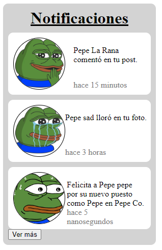

# Notifications Menu

```
Se te proporciona un archivo HTML que contiene la marcación para un menú de notificaciones. Usando solo CSS, replica la salida esperada siguiendo estas especificaciones:

- El contenedor general tiene un ancho de 280px, 10px de relleno a cada lado (creando un ancho total de 300px), un radio de borde de 10px y un color de fondo de gris claro.
- El encabezado "Notificaciones" está centrado horizontalmente y el texto está subrayado. Hay un espacio vertical de 10px entre el encabezado y la primera notificación. Se debe eliminar cualquier margen predeterminado de este encabezado.
- Hay un espacio vertical de 10px entre cada notificación. Cada notificación está centrada horizontalmente, con 10px de espacio entre la notificación y el borde del contenedor. Cada notificación tiene 10px de relleno en todos los lados, un radio de borde de 10px y un color de fondo blanco.
- Cada notificación tiene una imagen, que es de 100px por 100px y es un círculo perfecto. Estas imágenes también tienen un borde sólido de 1px en color negro.
- El párrafo de la notificación está a la derecha de la imagen, con 10px de espacio entre ellos. Se debe eliminar cualquier margen predeterminado de los párrafos. Cualquier texto dentro del elemento .user está en negrita.
- El span con la clase "time" está en la esquina inferior derecha de la notificación. Este texto tiene un peso de fuente normal, un tamaño de fuente de 12px y está en cursiva.
- El botón "Ver Más" está 10px debajo de la última notificación. Este botón tiene el mismo ancho que las notificaciones y está centrado horizontalmente. El botón tiene un tamaño de fuente de 16px, un radio de borde de 10px, 10px de relleno en todos los lados, un color de fondo de #02203c y un color de texto blanco.

Tu entrega será evaluada en función de cuán similar sea la salida en el navegador a la salida esperada; debería ser casi idéntica.
```

## HTML (no modificar)
```html
<div id="wrapper">
  <h1>Notifications</h1>

  <div id="notifications">
    <div class="notification">
      
      <p><span class="user">Pepe La Rana</span> comentó en tu post.</p>
      <span class="time">hace 15 minutos</span>
    </div>


    <div class="notification">
      
      <p><span class="user">Pepe sad</span> lloró en tu foto.</p>
      <span class="time">hace 3 horas</span>
    </div>


    <div class="notification">
      
      <p>
      Felicita a <span class="user">Pepe pepe</span> por su nuevo puesto como Pepe en Pepe Co.
      </p>
      <span class="time">hace 5 nanosegundos</span>
    </div>
  </div>

  <button>Ver más</button>
</div>
```

## Sugerencia de presentación

