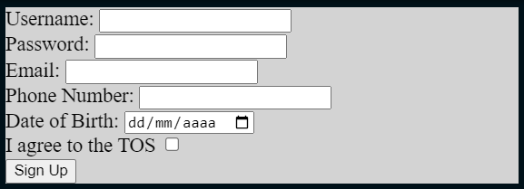

# HTML 1 - Formulario de Registro

```
Implementa un formulario de registro en HTML con los siguientes seis campos de entrada, cada uno con una etiqueta apropiada:

* Nombre de usuario, un campo de texto requerido.
* Contraseña, un campo de contraseña requerido.
* Correo electrónico, un campo de correo electrónico requerido.
* Número de teléfono, un campo de teléfono opcional.
* Fecha de nacimiento, un campo de selección de fecha opcional.
* Acepto los Términos y Condiciones, un campo de checkbox requerido.
* También debe haber un botón de 'Registrarse' al final del formulario. Cuando se haga clic en el botón (y si se han completado todos los campos requeridos), el botón debe enviar el formulario utilizando el comportamiento predeterminado del navegador.

Solo necesitas escribir el HTML que iría dentro de la etiqueta <body> del documento; NO ES NECESARIO preocuparse por la etiqueta <head>, la etiqueta <html> ni la declaración <!DOCTYPE>.
```
## Sugerencia de presentación
1

2

## Sugerencia de solución
```html
<form>
  <!-- Campo de usuario -->
  <label id="username-label" for="username" required>Campo:</label>
  <input id="username" type="text">

  <br> <!-- Salto de línea -->

  <label>Texto del label</label>
  <input ...>
  ...
  <input type="submit" value="Registrarse">
</form>
```