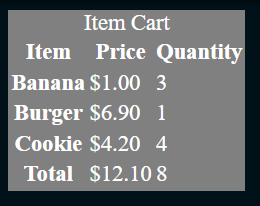

# HTMl 2 - Carrito de compra

```
Implementa un carrito de compras en HTML con los siguientes datos estáticos:

|   Producto   |   Precio   |   Cantidad |
|-------------+-----------+--------------|
|   Plátano   | $1.00     | 3            |
|  Hamburguesa | $6.90     | 1           |
|    Galleta  | $4.20     | 4            |
|-------------+-----------+--------------|
|    Total    | $12.10    | 8            |

El código HTML debe usar una tabla con el marcado semántico adecuado y con el título "Carrito de Compras".

Solo necesitas escribir el HTML que iría dentro de la etiqueta <body> del documento; NO ES NECESARIO preocuparse por la etiqueta <head>, la etiqueta <html> ni la declaración <!DOCTYPE>.
```

## CSS
```css
  table, caption{
  background-color:grey;
  color:white;
  font-size:18px;
  }
```

## Sugerencia de presentación

