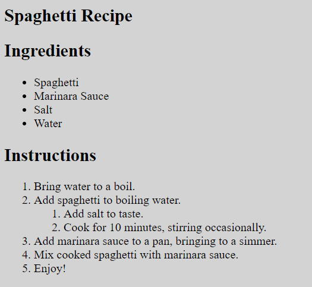

# HTML 3 - Receta

**Nota:** si quieres hacer otro tipo de receta, el contenido en texto no se revisará en este ejercicio, solo el marcado HTML.

--

```
Se te ha proporcionado una receta de espaguetis en texto plano, y necesitas convertir esta receta en un archivo HTML correctamente marcado.

La receta debe tener un encabezado principal que diga "Receta de Espaguetis", y debe dividirse en dos secciones, los ingredientes y las instrucciones, con los encabezados "Ingredientes" e "Instrucciones", respectivamente.

Los ingredientes son una lista desordenada con el siguiente contenido:

• Espaguetis
• Salsa marinara
• Sal
• Agua

Las instrucciones son una lista ordenada con el siguiente contenido:

1. Llevar el agua a ebullición.
2. Agregar los espaguetis al agua hirviendo.
   1. Agregar sal al gusto.
   2. Cocinar durante 10 minutos, revolviendo ocasionalmente.
3. Agregar la salsa marinara a una sartén, llevar a fuego lento.
4. Mezclar los espaguetis cocidos con la salsa marinara.
5. ¡Disfruta!

Ten en cuenta que "Agregar sal al gusto." y "Cocinar durante 10 minutos, revolviendo ocasionalmente." están en una lista secundaria bajo la segunda instrucción.

Tu código HTML debe usar un marcado semántico adecuado. Sin embargo, solo necesitas escribir el HTML que iría dentro de la etiqueta <body> del documento; NO ES NECESARIO preocuparse por la etiqueta <head>, la etiqueta <html> ni la declaración <!DOCTYPE>.
```

## CSS

```css
  body {
  background-color: grey;
  }
```

## Sugerencia de presentación

